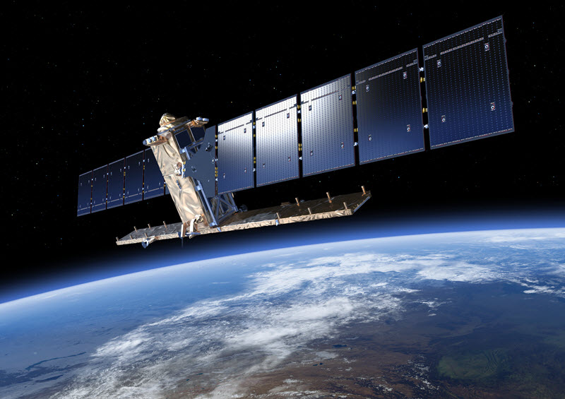
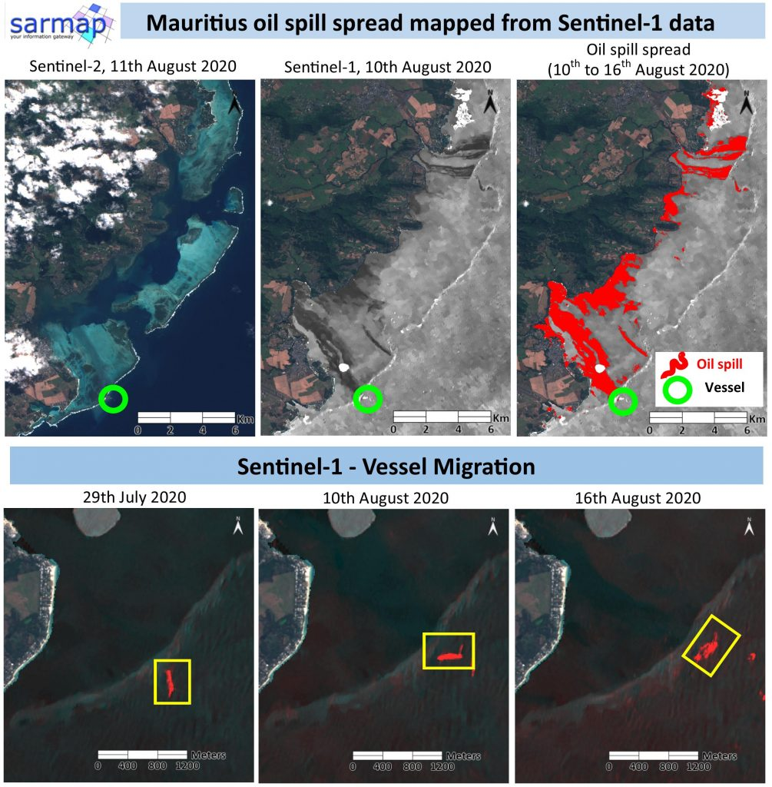
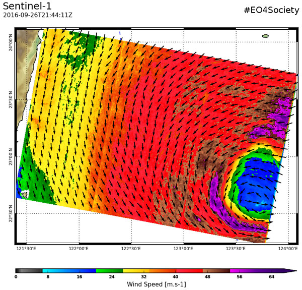
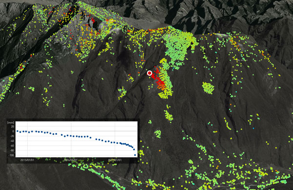
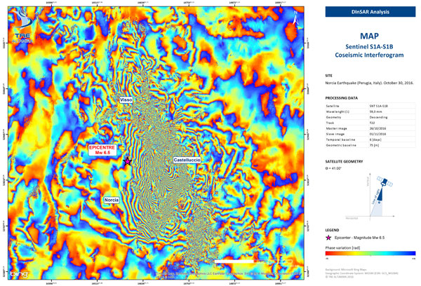

```{r setup, include=FALSE}
options(htmltools.dir.version = FALSE)
knitr::opts_chunk$set(
  fig.width=9, fig.height=3.5, fig.retina=3,
  out.width = "100%",
  cache = FALSE,
  echo = TRUE,
  message = FALSE, 
  warning = FALSE,
  hiline = TRUE
)
```

```{r xaringan-themer, include=FALSE, warning=FALSE}
library(xaringanthemer)
style_duo_accent(
  primary_color = "#2881C6",
  secondary_color = "#1381B0",
  inverse_header_color = "#FFFFFF",
  #header_font_google = google_font("Josefin Sans"),
  #text_font_google   = google_font("Montserrat"),
  #text_font_google   = google_font("Montserrat", "300", "300i"),
  code_font_google   = google_font("Fira Mono"),
)
```

class: center, title-slide, middle

background-image: url("img/0.1Sentinel-1B_lifts_off_pillars.jpg")
background-size: cover
background-position: center

# Sentinel-1 Satellite

## Ariel Ren
### CASA, UCL
### 18/03/2024

---

## Let's step into the world of Sentinel-1
<iframe width="840" height="473" src="https://www.youtube.com/embed/i1J0L5dNin8" frameborder="0" allow="accelerometer; autoplay; encrypted-media; gyroscope; picture-in-picture" allowfullscreen style="display: block; margin: auto;"></iframe>

---

## 1.1 Introduction

- **Sentinel-1** is the **first** EO satellite launched by European Space Agency (ESA) as part of the **Copernicus** (world's largest EO program).

- **Sentinels** fly **in pairs** to **shorten revisit time** to any point on Earth.

- **Sentinel-1** consists of **two satellites**, with **Sentinel-1A** launched in April 2014 and **Sentinel-1B** in April 2016.

.pull-middle[
```{r echo=FALSE, out.width='47%', fig.align='center'}

```
]
source:[ESA](https://www.esa.int/ESA_Multimedia/Images/2014/02/Sentinel-1), [Torres et al., 2012](https://doi.org/10.1016/j.rse.2011.05.028)

---
## 1.2 Key attributes

- an imaging radar mission provides **continuous all-weather, day-and-night imagery** at C-band.

- 1A & 1B two satellites orbit 180° apart, which can **image the entire Earth every six days**.

                          
<br/>

|       **Operational modes**      |                                     |
| -------------------------------- | ------------------------------------|
| Interferometric wide-swath mode  | 250 km and 5×20 m resolution        |
| Wave mode       |20×20 km and 5×5 m resolution (at 100 km intervals)   |
| Strip map mode    | 80 km swath and 5×5 m resolution                   |
| Extra wide-swath mode    | 400 km and 20×40 m resolution               |

source:[ESA](https://www.esa.int/Applications/Observing_the_Earth/Copernicus/Sentinel-1/Facts_and_figures)

---
class: inverse,middle,center

# 2. Applications
---

## 2.1 Maritime Monitoring

```{r xaringan-panelset-1, echo=FALSE}
xaringanExtra::use_panelset()
```

.panelset[.panel[.panel-name[Ice Monitoring]

.pull-left[
- <small> High-res ice charting **ensures safe navigation** in Arctic zones with **iceberg and sea-ice data**.

- Provides details on **sea-ice concentration, extent, type, thickness, and drift**; **tracks icebergs** as well.

- Sentinel-1's data **enhances ice classification**, aiding environmental and transportation impact assessments.
]

.pull-right[
```{r echo=FALSE, out.width='80%', fig.align='middle'}
knitr::include_graphics("img/Monitoring_the_rift.gif")
```
]

<br/>
source: [Sentinels.Copernicus](https://sentinels.copernicus.eu/web/sentinel/user-guides/sentinel-1-sar/applications/maritime-monitoring)

]


.panel[.panel-name[Oil Pollution Monitoring]

.pull-left[
- <small> Use SAR imagery's **dark features for slicks** identifies illegal discharges and oil spills, and aids in oil prospecting.

- SAR Sentinel-1 data **excels in mapping oil spills**, offering **clearer visibility** than optical Sentinel-2 imagery.

- Detection of naturally occurring oil seepage from the ocean floor can **provide clues for oil prospecting**.
]

.pull-right[
```{r echo=FALSE, out.width='80%', fig.align='middle'}

```
]

<br/>
source: [SARMAP](https://www.sarmap.ch/index.php/2020/08/28/mauritius-oil-spill-spread-mapped-from-sentinel-1-data/), [Sentinels.Copernicus](https://sentinels.copernicus.eu/web/sentinel/user-guides/sentinel-1-sar/applications/maritime-monitoring)
]

.panel[.panel-name[Marine Winds]

.pull-left[
- <small> Sentinel-1 SAR technology **maps ocean surface roughness**, enabling precise wave and wind pattern analysis.

- Assists in critical applications like **weather forecasting, maritime navigation, and oil spill detection** by differentiating spills from look-alikes.
]
.pull-right[
```{r echo=FALSE, out.width='80%', fig.align='middle'}

```
]

<br/>
source: [Sentinels.Copernicus](https://sentinels.copernicus.eu/web/sentinel/user-guides/sentinel-1-sar/applications/maritime-monitoring)
]
]

---
## 2.2 Emergency Management

```{r xaringan-panelset-2, echo=FALSE}
xaringanExtra::use_panelset()
```

.panelset[.panel[.panel-name[Flood Monitoring]

.pull-left[
- <small> Over 75% of natural disasters involve **flooding, challenging to monitor** from space due to accompanying clouds.

- Sentinel-1’s radar ability to **‘see’ through clouds, rain and in darkness** makes it particularly useful for monitoring floods.

- Before-and-after flood imagery can offer immediate information, **aiding in damage assessment and response**.
]

.pull-right[
```{r echo=FALSE, out.width='80%', fig.align='middle'}
knitr::include_graphics("img/Copernicus_Sentinel-1_maps_Bangladesh_flood_pillars.gif")
```
]

<br/>
source: [ESA](https://www.esa.int/ESA_Multimedia/Images/2022/06/Copernicus_Sentinel-1_maps_Bangladesh_flood), [Sentinels.Copernicus](https://sentinels.copernicus.eu/web/sentinel/user-guides/sentinel-1-sar/applications/emergency-management)

]


.panel[.panel-name[Landslide Monitoring]

.pull-left[

- <small> SAR interferometry **identifies landslide-prone areas** and **monitors surface changes** for disaster early warning.

- The **displacement time series** superimposed reveals **clear precursory movement** months before the event.
]

.pull-right[
```{r echo=FALSE, out.width='100%', fig.align='middle'}

```
]

<br/>
<br/>
<br/>
source: [SARMAP](https://www.sarmap.ch/index.php/2020/08/28/mauritius-oil-spill-spread-mapped-from-sentinel-1-data/), [Sentinels.Copernicus](https://sentinels.copernicus.eu/web/sentinel/user-guides/sentinel-1-sar/applications/emergency-management)
]

.panel[.panel-name[Earthquake & Volcano]

.pull-left[
- <small> InSAR creates **detailed maps of earthquake deformations**, identifies active faults, and assesses risks through continuous monitoring of prone areas.

- Its Wide swath mode **improves** the ability to **monitor large-scale earthquakes** efficiently.

- SAR interferometry tracks volcanic activity by measuring pre-eruption uplift and post-eruption shrinkage, **enhancing volcano observatory data**.
]

.pull-right[
```{r echo=FALSE, out.width='100%', fig.align='middle'}

```
]

<br/>
source: [Sentinels.Copernicus](https://sentinels.copernicus.eu/web/sentinel/user-guides/sentinel-1-sar/applications/emergency-management)
]
]

---
class: inverse,middle,center

# 3. Reflection
---

### 3.1 Reflection

- <small> Sentinel-1 represents a triumph of European space innovation, showcasing the prowess of EO technology.
   
- Unfortunately, **Sentinel-1B** encountered an accident, bringing its mission to an **end in 2022**.

- To fill the void left by Sentinel-1B and to ensure ongoing data coverage, ESA & EU are deploying successor satellites like Sentinel-1C and Sentinel-1D.

- The end of Sentinel-1B's mission means more than the loss of a satellite; it **signifies the interruption of a vital data stream** that many people depended on.

- However, the lessons learned from Sentinel-1B's operations are invaluable, set to **guide** the development of **future satellites**.

### 3.2 Future Direction

- The wealth of data from Sentinel-1 opens up enormous possibilities for future work, particularly in integrating with **AI and machine learning**.

- Sentinel-1 data, paired with cutting-edge technologies, could **revolutionizing the way we anticipate and respond to natural disasters**, saving lives and reducing economic impacts.

---
### References

<small> 

ESA. “Aplications of Sentinel-1” Accessed 18 March 2024. https://www.esa.int/Applications/Observing_the_Earth/Copernicus/Sentinel-1

SARMAP. “Mauritius oil spill spread mapped from Sentinel-1 data” Accessed 18 March 2024.
https://www.sarmap.ch/index.php/2020/08/28/mauritius-oil-spill-spread-mapped-from-sentinel-1-data/

Sentinels.Copernicus. “Sentinel-1 SAR User Guide” Accessed 18 March 2024.
https://sentinels.copernicus.eu/web/sentinel/user-guides/sentinel-1-sar

Torres, R., Snoeij, P., Geudtner, D., Bibby, D., Davidson, M., Attema, E., Potin, P., Rommen, B., Floury, N., Brown, M., Traver, I. N., Deghaye, P., Duesmann, B., Rosich, B., Miranda, N., Bruno, C., L’Abbate, M., Croci, R., Pietropaolo, A., … Rostan, F. (2012). GMES Sentinel-1 mission. Remote Sensing of Environment, 120, 9–24. https://doi.org/10.1016/j.rse.2011.05.028

Youtube. “Sentinel-1 - 'Radar Vision'” Accessed 18 March 2024.
https://www.youtube.com/watch?v=i1J0L5dNin8&t=1s